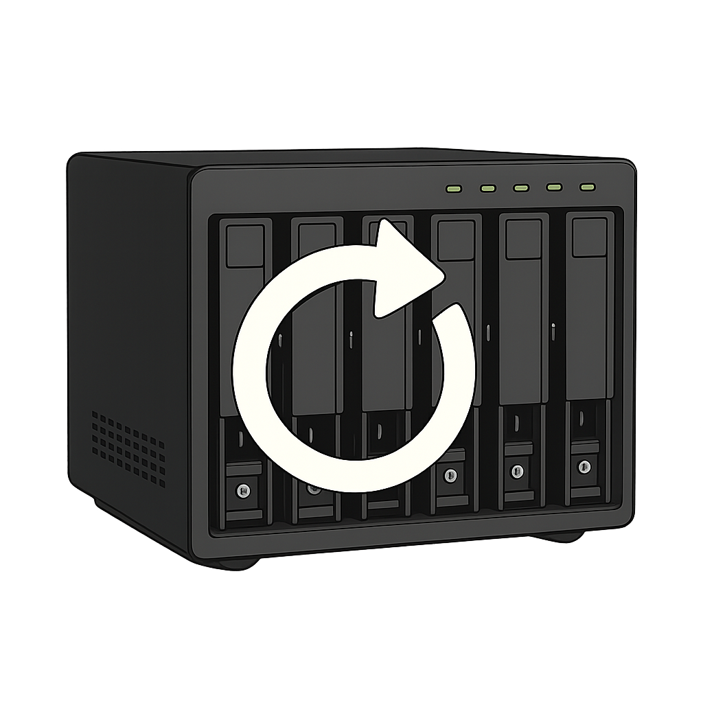
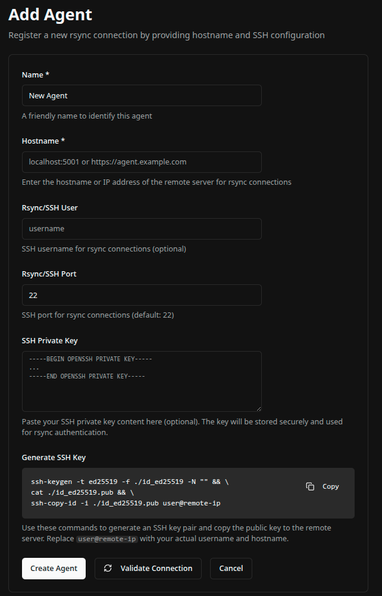

# Remember Backup System

This system centralizes backups from multiple sources. It’s designed to run alongside ZFS or similar technologies, including TrueNAS Scale. Since it doesn’t provide its own versioning mechanism, ZFS or TrueNAS handles versioning automatically.  



## Features

- Multi-agent backup management with secure pairing
- Flexible cron-based scheduling with human-readable descriptions
- Backup simulation to preview changes before execution
- Manual backup execution on demand
- Detailed logging with filtering and sorting capabilities
- File system browsing for both remote agents and local server
- Active/inactive backup plan management
- Intelligent file comparison (by name and size) to minimize unnecessary transfers

## API Testing

The `HTTPTests` directory contains API test collections for use with [Bruno](https://www.usebruno.com/) - a modern, open-source API client.

To use the test collections:
1. Install Bruno from [https://www.usebruno.com/](https://www.usebruno.com/)
2. Open Bruno and import the `HTTPTests` folder
3. Configure the environment variables in `HTTPTests/environments/dev.bru`
4. Run tests against the Server and Agent endpoints

## Getting Started

### Prerequisites

- It is advisable to use it with TrueNAS, ZFS, or another system that supports version control. 
- Docker and Docker Compose installed on your system
- A web browser (Chrome, Firefox, Edge, etc.)

### Server Installation 

#### Step 1: Get the files and Start the Server

You can clone the repository:
```bash
git clone https://github.com/hudsonventura/remeber.git &&
cd remember &&
sudo docker compose up -d
```

or copy the content of `docker-compose.yml`, from [here](https://github.com/hudsonventura/remeber/blob/main/docker-compose.yml), on your computer and run:
```bash
sudo docker-compose up -d
```


This will:
- Download the server image from Docker Hub
- Start the server container
- Create necessary data directories
- Initialize the database


> [!CAUTION] 
> Note you have to infom the volumes, paths to the agent access you PC. Put as much as you need. Note the `:ro` at the provides ready-only access.  

```
 volumes:
      - /path/your/files:/host:ro  # Read-only mount of host filesystem
```


#### Step 2: SSL Certificate
For security reasons, this system runs over SSL. Unfortunately, the certificate used is self-signed; however, it is sufficient to provide the necessary encryption to prevent your data from being intercepted by unauthorized parties.  
This way, the connection between you and the server is encrypted, as the same way between the server and the agents.


**Important:** Before accessing the server, you must accept the self-signed SSL certificate:

1. Open your browser and navigate to: **https://localhost:5001/login**
2. You will see a security warning about the certificate
3. Click "Advanced" or "Show Details"
4. Click "Proceed to localhost" or "Accept the Risk and Continue"
5. Once the certificate is accepted, you can access the frontend normally


This step is required because the backend uses a self-signed certificate for HTTPS, and browsers need to trust it before making API requests.


#### Step 5: Login

1. Navigate to **https://localhost:5001/login** in your browser
2. The default user and pass is `user@example.com`and `password123`. Change ir soon as possible.  


#### Step 6: Install Agent
If you’ve already installed your agents, you can skip to the next step.  

##### Step 6.1: Install on Linux as Docker
On another machine from which you want to send files to the server, in other words, the machi you want to be backuped, you can clone the repository:
```bash
git clone https://github.com/hudsonventura/remeber.git &&
cd remember/src/agents/linux &&
sudo docker compose up -d
```

or copy the content of `src/agents/linux/docker-compose.yml`, from [here](https://github.com/hudsonventura/remeber/blob/main/src/agents/linux/docker-compose.yml), on your computer and run:
```bash
sudo docker-compose up -d
```

> [!CAUTION] 
> Note you have to infom the volumes, paths to the agent access you PC. Put as much as you need. Note the `:ro` at the provides ready-only access.  

```
 volumes:
      - /path/your/files:/host:ro  # Read-only mount of host filesystem
```


##### Step 6.2: Install on Linux as Service using systemd
Soon


##### Step 6.3: Install on Windows
Soon


##### Step 6.4: Agent Code
The agent generates an authorization code required to connect to it. This adds an extra layer of security and prevents unauthorized users from connecting to the agent.  

> [!CAUTION] 
> When the agent is running, it will generate a code. Make sure to write it down. This code will be valid for 10 minutes. If that time passes, turn the agent off and back on so it can generate a new code.  


#### Step 7: Add an Agent

1. From the main dashboard, click on **"Agents"** in the sidebar
2. Click the **"Add Agent"** button (top right)
3. Fill in the agent details:
   - **Name**: Enter a friendly name for the agent (e.g., "Production Server", "Backup Server 1")
   - **Hostname**: Enter the agent's address (e.g., `https://agent.example.com:5002` or `localhost:5002`)
   - **Pairing Code**: Enter the 6-digit pairing code displayed in the agent's console





#### Step 3: Add a Backup Plan

1. Navigate to the agent's backup plans page:
   - Click on **"Agents"** in the sidebar
   - Click on an agent name to view its backup plans
   - Or click the **"Edit"** button next to an agent and navigate to backup plans

2. Click the **"Add Backup Plan"** button


3. Fill in the backup plan details:
   - **Name**: Enter a descriptive name (e.g., "Daily Documents Backup")
   - **Description**: Optional description of what this backup plan does
   - **Schedule**: Enter a cron expression (e.g., `0 0 * * *` for daily at midnight)
     - Use the description below the field to see what the cron expression means
   - **Source Path (Agent)**: Click the folder icon to browse and select the source directory on the agent. The text field is open to you create another dir.
   - **Destination Path (Server)**: Click the folder icon to browse and select the destination directory on the server. The text field is open to you create another dir.
   - **Active**: Check this box to enable automatic backups according to the schedule. If it’s disabled, backups won’t start automatically; however, you can still run them manually


4. Click **"Create Backup Plan"**


#### Step 4: Simulate a Backup

Before running an actual backup, it's recommended to simulate it first to see what changes will be made:

1. Navigate to the backup plan you want to test:
   - Go to **"Agents"** → Select an agent → Find the backup plan
   - Click **"Edit"** on the backup plan

2. Click the **"Simulate"** button


3. Wait for the simulation to complete. The results will show:
   - Files that will be copied
   - Files that will be deleted
   - Files that will be ignored (and why)
   - Total size of files to be transferred


4. Review the simulation results to ensure everything looks correct
5. Click **"Close"** when done reviewing

#### Step 5: Execute a Backup

Once you're satisfied with the simulation results, you can execute the backup:

1. On the backup plan edit page, click the **"Execute Now"** button
2. Confirm the execution in the dialog that appears


3. The backup will start running in the background
4. You'll see a success message confirming the backup has started


5. To monitor the backup progress:
   - Navigate to the backup plan's logs page
   - Click on **"View Logs"** or navigate to the logs section
   - You'll see real-time updates of files being copied, deleted, or ignored


### Database

The application uses SQLite databases on `data` dir on server:
- `remember.db` - Main database (agents, backup plans, users)
- `logs.db` - Backup operation logs

And on agents:
- `agent.db` - Store JWT of the server authorized


## License

This project is licensed under the MIT License.

## Author

Developed by [Hudson Ventura](https://github.com/hudsonventura)

